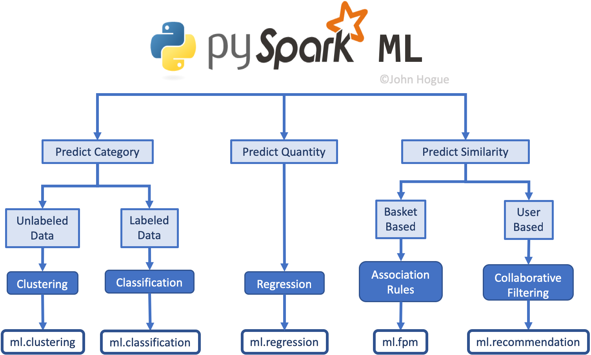

# pySparkTraining

## Introduction

1. What is Spark?
2. Using Spark in Python
    - 2.1 Connecting to a cluster
3. Examining the SparkContext
4. Using DataFrames
    - 4.1 Creating a SparkSession
5. Creating a DataFrame from a local file 
6. Creating a DataFrame from a RDD 

## Manipulating data

1. Creating columns
2. Renaming columns
3. Selecting columns 
4. Creating columns with the .select() method
5. Filtering
6. Joins 

